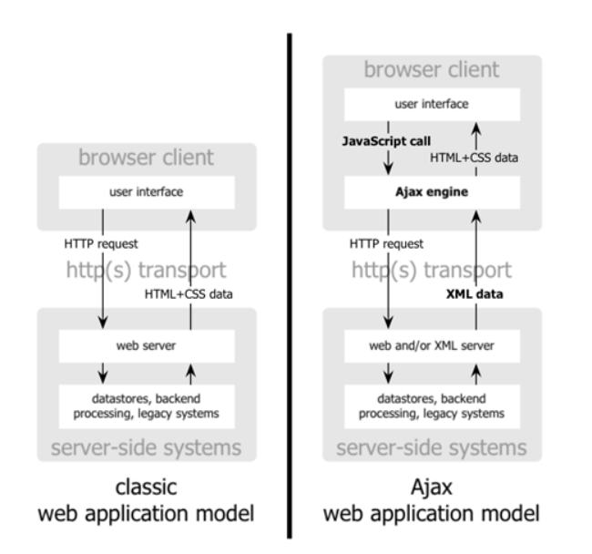
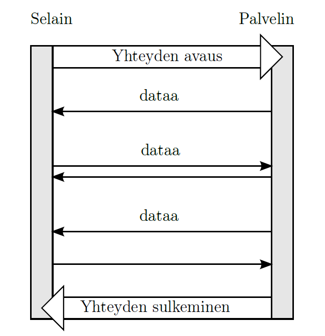
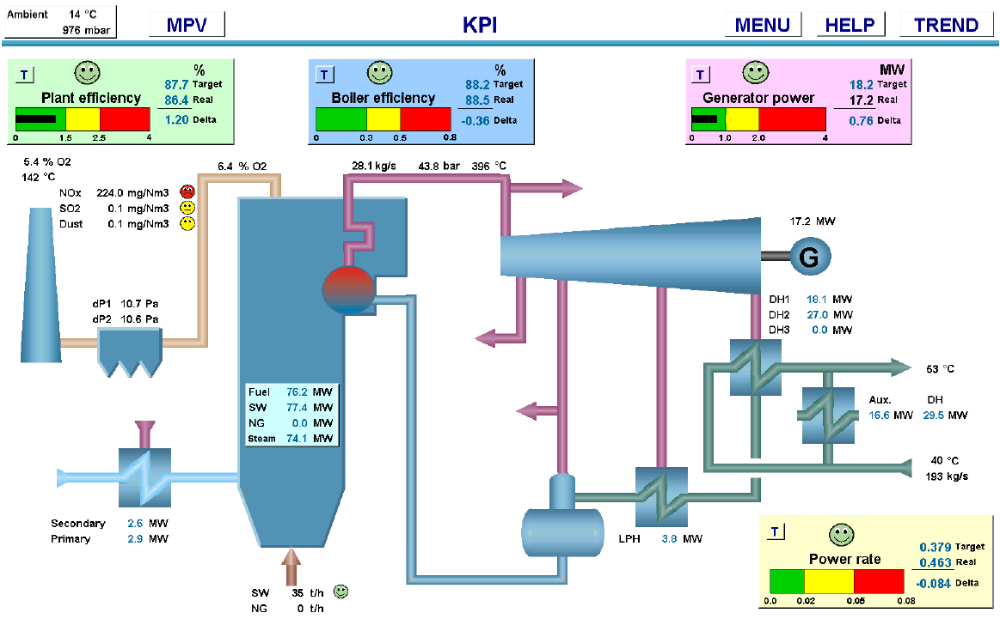
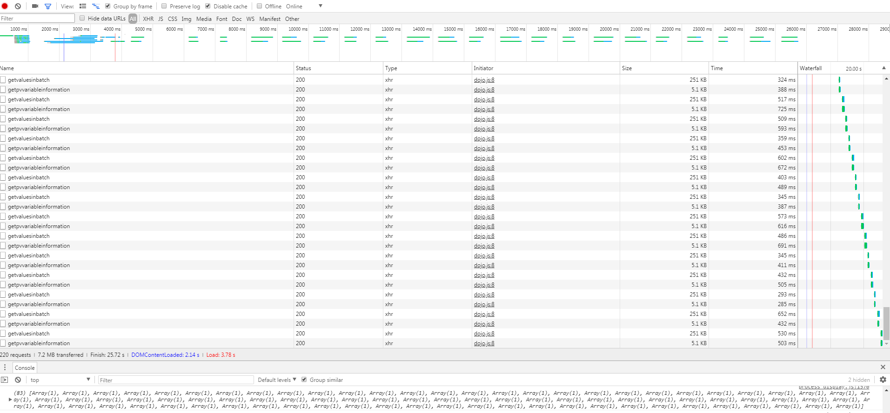
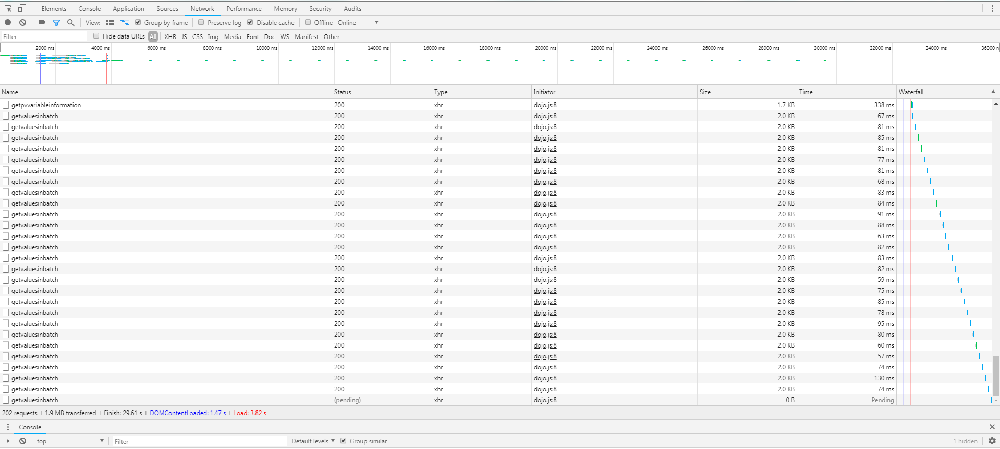
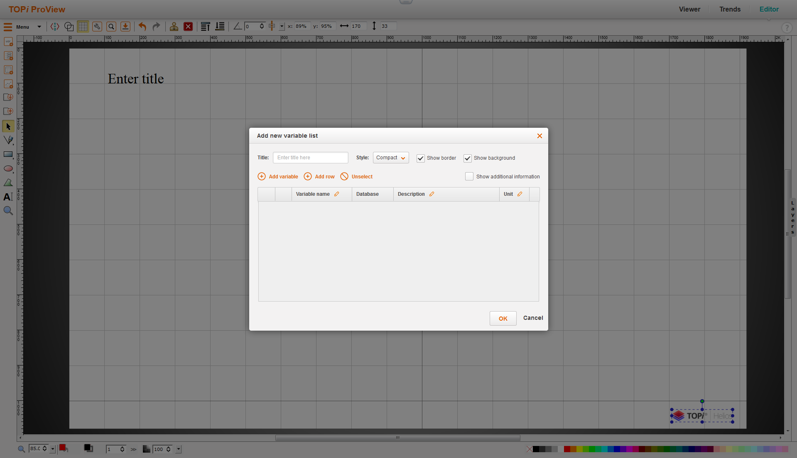
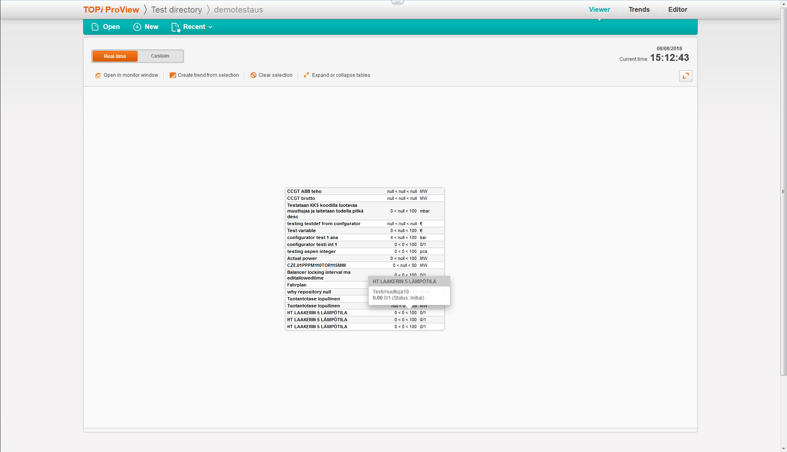

# Voimalaitosdatan visualisointityökalun jatkokehitys

## 1. Johdanto

Kristian Laakkonen toteutti diplomityönään selainpohjaisen ProView-nimisen tietojärjestelmän, jonka avulla voidaan havainnollistaa prosessitietoja käyttäjäystävällisesti. Tietojärjestelmässä voidaan luoda käyttäjille helppolukuisia prosessikaavionäyttöjä.

Järjestelmä tehtiin, koska aikaisemmissa työpöytäsovelluksissa on ollut omat rajoitteensa. Esimerkiksi työpöytäsovellukset täytyy asentaa erikseen kaikille tietokoneille ja ne on usein sidottu vain yhdelle käyttöjärjestelmälle ja myös ohjelmistojen päivitys on täytynyt tehdä jokaiselle koneelle erikseen. Diplomityönä valmistunut selainpohjainen järjestelmä korjasi nuo puutteet. Työasema tarvitsee vain web-selaimen, jonka avulla käyttäjä pääsee käyttämään järjestelmää. Järjestelmän ylläpito ja päivitykset tapahtuvat palvelinpäässä ja loppukäyttäjien suunnalta ei tarvita toimenpiteitä. Järjestelmä on ollut yleisessä käytössä useammalla asiakkaalla jo useamman vuoden. Tässä ajassa eri käyttäjäryhmät ovat tehneet paljon parannusehdotuksia.

Opinnäytetyöni käsittelee näitä parannusehdotuksia ja niiden toteuttamista. Tarkoituksena on toteuttaa versiopäivitys ProView 1.0:sta versioon ProView 1.1. Toimeksiantajana toimii Fortum Power and Heat Oyj. Parannusehdotusten toteuttaminen tekee tietojärjestelmästä enemmän asiakkaiden toiveiden mukaisen ja sitä kautta se tuo myös lisäarvoa toimeksiantajalleni.

### 1.1  Tavoitteet

Työn tavoitteena oli jatkokehittää Kristian Laakkosen diplomityönä valmistunutta järjestelmää käyttäjäpalautteiden pohjalta ja sen avulla kasvattaa omaa osaamistani. Parannusehdotuksien suunnittelussa ja toteutuksessa joudun kiinnittämään huomiota minulle uusiin asioihin ohjelmistokehityksessä ja pääsen tutustumaan energia-alan lainalaisuuksiin. Työn suurimmat haasteet tulevat olemaan olemassaolevan ProView-työkalun ohjelmakoodin tulkinta ja siinä käytettyjen ratkaisujen ymmärtäminen. Projektissa on myös käytetty minulle tuntemattomia JavaScript-kirjastoja, joten myös niiden ymmärtäminen tulee olemaan oma haasteensa. Korostan myös sitä, että minulle energia-ala ja sen lainalaisuudet ovat lähes tuntemattomia, joten tarkoituksena on myös ymmärtää, että miksi toivottuja muutoksia tehdään ja mikä niiden merkitys on.

### 1.2 Rajaus

Opinnäytetyössä ei toteuteta uutta sovellusta, eikä uusia toiminnallisuuksia olemassa olevaan sovellukseen. Tarkoituksena on tutkia jo olemassa olevia ratkaisuja ja parannella niitä käyttäjäpalautteiden pohjalta. Opinnäytetyössä kerrotaan parannusehdotusten taustat, miksi ne halutaan ja niiden kehityskulku. Opinnäytetyössa ei keskitytä kertomaan verkkosivuista ja niiden toimintaperiaatteista yleisellä tasolla, koska niistä aiheista löytyy materiaalia internetistä jo valmiiksi, enkä usko niiden tuovan lisäarvoa tälle opinnäytetölle. Pidän itseäni ohjelmistokehittäjänä, enkä graafisena suunnittelijana, joten prioriteettini on tehdä laadukasta ja toimivaa ohjelmakoodia ja kehityskohteiden graafinen ulkoasu ei ole toteutuksen kärkipäässä.

## 2. Tiedonsiirto

Tässä luvussa avataan erilaisia tiedonsiirtotekniikoita, joiden käyttämistä käsitellään opinnäytetyössä. Tiedonsiirrolla tarkoitetaan sitä prosessia millä käyttäjän syöttämä data siirretään esimerkiksi tietokantaan tai miten käyttäjän hakema data palautetaan tietokannasta verkkosivulle.

### 2.1 Ajax

Ajax, eli Asynchronous JavaScript and XML on kokonaisuus erilaisia web-teknologioita, mitkä mahdollistavat tiedonsiirron selaimen ja palvelimen välillä dynaamisesti niin, että sivua ei tarvitse ladata aina uudelleen. Aikaisemmin tiedonsiirto tapahtui käyttäjän kannalta paljon rasittavammalla tavalla, sillä ennen pienikin muutos vaati sitä, että koko sivu ladattiin uudelleen. Ajax mahdollistaa asynkronisen tiedonsiirron, minkä avulla käyttäjän ei tarvitse katsella tyhjää ruutua sillä välin kun selain pyytää palvelimelta uutta dataa. (Garret 2005)

 Kuva 1

Kuvassa 1 vasemmalla puolella näkyy "perinteinen" tiedonsiirtomalli, missä jokainen pyyntö palvelimalta pakottaa lataamaan koko sivun uudelleen. Kuvan oikealla puolella taas näkyy AJAXin tiedonsiirtomali, missä verkkosivuun upotettu "Ajax engine" hoitaa tiedonsiirron palvelimen ja selaimen välillä niin, että käyttäjän ei tarvitse ladata sivua uudelleen jokaisen pyynnön yhteydessä.

### 2.2 WebSocket

WebSocket-protokolla eroaa Ajaxista hieman. Ajax-kutsut tapahtuu niin, että jokaisen kutsun jälkeen avataan yhteys palvelimeen ja datan siirtämisen jälkeen yhteys suljetaan. Jos pyyntöjä tehdään paljon lyhyessä ajassa, niin se kuormittaa palvelinta, jos yhteyksiä joudutaan avaamaan ja sulkemaan jatkuvasti. WebSocketin tarkoituksena on avata yhteys kerran ja mahdollistaa useita tiedonsiirtopyyntöjä saman yhteyden aikana. (The WebSocket Protocol 2011)

 Kuva 2

Kuvassa 2 näkyy WebSocketin tiedonsiirtomalli, missä näkyy kuinka auki olevan yhteyden yli voidaan siirtää tietoa useaan kertaan.

## 3. Scrum

Scrum on ketterän projektityön viitekehys, minkä tarkoitus on tehdä monimutkaisesta projektityöstä mahdollisimman sujuvaa ja läpinäkyvää kaikille sidosryhmille. (What is Scrum?) Scrumissa työskentely aloitetaan niin, että Tuoteomistaja, joka on yksi Scrumin rooleista (Scrum Roles Demystified), luo priorisoidun kehitysjonon halutuista kehityskohteista. Seuraava vaihe on Sprintin suunnittelu, missä kehitystiimi valitsee seuraavaan sprinttiin kehityskohteet priorisoidun listan mukaan.

Sprintit ovat yleensä lyhyitä työjaksoja, missä kehitysryhmä keskittyy työskentelemään vain kyseiseen sprinttiin valituiden kehityskohteiden parissa. Sprintin lopussa pidetään katselmointi, missä kehitystiimi, Tuoteomistaja ja mahdollisia muita sidosryhmiä tarkastavat Sprintin tuloksen ja antavat palautetta. (What is a Sprint?) Tämä tuo läpinäkvyyttä projektityölle ja sidosryhmille mahdollisuuden nähdä projektin edistymisvaiheet. Lisäksi kehitystiimi voi reagoida muutostoiveisiin nopeasti ja tämän avulla asiakas saa varmemmin juuri toivotun kaltaisen lopputuloksen.

Opinnäytetyön aikana olin osana Scrum tiimiä, missä minä itse keskityin ProView 1.1 kehitykseen ja muut kehitystiimin jäsenet tekivät omia töitään saman sovelluskokonaisuuden parissa. Sidosryhmiin kuului ProView-työkalun käyttäjiä, joilta sain kehityksen aikana hyvää palautetta toteutuksistani ja kykenin yleensä myös reagoimaan niihin nopeasti. Ketterä kehitys ja Scrum toimi siis omalta osaltani loistavasti tämän projektin puitteissa.

## 4. Vektorigrafiikka

Digitaalisissa kuvat on yleensä jaettu kahteen eri kategoriaan, bittikarttakuviin ja vektorigrafiikkakuviin. Bittikarttakuvat koostuvat pikseleistä ja pikseleiden määrä riippuu kuvatiedoston määritetystä resoluutiosta, eli pikselitiheydestä. Mitä suurempi resoluutio, sitä tarkempi kuva ja samalla suurempi tiedostokoko. Ongelmana tällaisissa kuvissa on skaalautuvuus. Bittikarttakuvaa voidaan suurentaa, mutta sen resoluutio ei päivity samassa suhteessa, eli silloin myös pikselimäärät pysyy samana. Lopputuloksena on yleensä huomattavasti epätarkempi kuva. (Kerminen 2009a, 2)

Vektorigrafiikkakuvat eroavat bittikarttakuvista rakenteeltaan huomattavasti. Vektorigrafiikkatiedostoissa ei määritellä yksittäisiä pikseleitä, vaan tiedostoon määritellään kuvissa olevien objektien koordinaatisto, kuvan ankkuripisteet ja objektien muodot määritellään matemaattisien funktioiden avulla. Tämän takia vektorigrafiikkakuvat ovat resoluutioriippumattomia ja ne skaalautuvat helposti eri kokotarkoiutksiin. (Kerminen 2009b, 4, Kerminen 2009c, 5)

ProView-työkalulla tehdyt prosessikaavionäytöt koostuvat yleensä useista yksinkertaisista kuvioista ja niiden täytyy skaalautua tarvittaessa sekä normaalilla työpöydällä olevaan Full HD-resoluutioon ja voimalaitoksilla oleviin todella isoihin valvomonäyttöihin ja niiden laatu ei saa kärsiä. Tämän takia ProView:lla tehdyt prosessikaavionäytöt tallennetaan selaimissa toimiviksi SVG-tiedostoiksi.

## 5. ProView 1.0

ProView on SVG-Edit nimisen avoimen lähdekoodin vektorigrafiikkaeditorin päälle rakennettu tietojärjestelmä. (SVG-Edit) Järjestelmä on osa Fortumin TOPi-tuoteperhettä (TOPi Energiatiedon hallintajärjestelmä) TOPi siis kokonaisuudessaan yksi iso web-sovellus, mikä on jaettu pienempiin alisovelluksiin kuten ProView-työkalu. TOPi:n backend on ohjelmoitu Javalla Spring-ohjelmointikehystä käyttäen (Spring) ja järjestelmän frontendissä on pääasiassa käytetty Dojo-nimistä ohjelmointikirjastoa. (Dojo Toolkit) ProView-työkalulla on kaksi käyttötarkoitusta: Sillä täytyy pystyä luomaan ja tarkastelemaan prosessinäyttöjä. Prosessinäyttöjen luomiseen tarvittiin editori, mikä on tarpeeksi käyttäjäystävällinen ja että siinä on riittävästi toiminnallisuuksia. Nämä vaatimukset huomioon ottaen, päädyttiin valitsemaan SVG-Edit järjestelmän pohjaratkaisuksi.

 Kuva 3

Kuvassa 3 näkyy prosessinäyttö, jossa on esitetty voimalaitoksen suorituskyvyn kannalta olennaiset luvut.

ProView:n prosessinäytöissä on staattisia ja muuttuvia elementtejä. Staattisilla elementeillä kuvataan yleensä eri prosessien yleinen kulku ja ns. isompi kokonaisuus. Muuttuvat elementit ovat prosessin sisällä olevat muuttujat, mitkä näyttävät erilaisia arvoja. Nämä arvot voivat olla esimerkiksi erilaisten pumppujen lämpötilat ym. prosessille tärkeät tiedot. ProView:n näyttöjä pidetään laitosten valvomoilla auki jatkuvasti ja on tarkoitus, että näiden näyttöjen perusteella voidaan tarkastella voimalaitosten eri prosesseja lähes reaaliaikaisesti. Tämän takia tietojärjestelmän täytyy hakea muuttujien arvoja tietokannasta tasaisin väliajoin.

Kristian Laakkosen diplomityön toteutushetkellä todettiin, että prosessinäytössä olevien muuttujilla pitää olla muutaman sekunnin päivitysväli. Nämä vaatimukset huomioon ottaen todettiin, että WebSocket-teknologia olisi paras muuttujien arvojen hakemiseen tietokannasta, mutta ongelmaksi muodostui selaintuki. Järjestelmän täytyi tukea Internet Explorerin versioita 9, 10 ja 11 ja siksi tämä teknologia täytyi hylätä. Koska WebSocket ei ollut toimiva ratkaisu, niin tiedonsiirtoon päätettiin käyttää AJAXia. (Asynchronous JavaScript and XML) (Laakkonen 2015a, 35; Laakkonen 2015b, 55; Laakkonen 2015c, 32; Laakkonen 2015d, 55)

## 6. Kehityskohteet

Valitsimme ProView:n tuoteomistajan kanssa opinnäytetyölle kymmenen eri kehityskohdetta. Työskentely kehityskohteiden kanssa tapahtui Scrumin mukaisesti. Työskentelin niiden kanssa osa-aikaisesti kahden viikon sprinteissä ja työ todettiin valmiiksi, jos Sprintin katselmoinnissa ei löytynyt mitään valitettavaa.

### Editor-työkalun ruudukko-ominaisuus

ProView:n piirtotyökalussa on olemassa erillinen ruudukko-ominaisuus mikä tekee mm. viivojen piirtämisestä selkeämpää. Tämä ominaisuus täytyy erikseen valita, mutta käyttäjäpalautteen perusteella sen tulisi olla oletuksena päällä.

 Kuva 4

Kuvasta 4 näkyy miltä ProView:n ruudukko-ominaisuus näyttää käytännössä.

### Uudet resoluutiovaihtoehdot

Piirrettäville näytöille oli asetettu oletusresoluutioksi 1024 x 768 pikseliä. Toiveena oli lisätä erilaisia resoluutiovaihtoehtoja ja laittaa oletukseksi Full HD -resoluutio, eli 1920 x 1080 pikseliä.

### Pikanäppäin-painike

Editorityökalussa on useita erilaisia piirtotyökaluja ja ominaisuuksia, mihin löytyy myös pikanäppäimet sen sijaan, että käyttäjän tulisi valita hiirellä aina oikea työkalu. Ongelmana oli lähinnä se, että löytääksesi oikean pikanäppäimen työkalulle, sinun piti viedä hiiri haluamasi työkalun kohdalle ja vasta sitten ohjelma kertoi sinulle kyseisen työkalun pikanäppäimen. Toiveena oli saada editorityökaluun oma painike, mitä painamalla se näyttäisi sinulle kaikki eri työkalut ja niiden pikanäppäimet.

### Visuaalisten komponenttien uudelleensijoittelu

Uusiin näyttöihin voi lisätä erilaisia visuaalisia komponentteja. Neljä visuaalista komponenttia on laitettu oman painikkeen taakse. Nämä komponentit ovat: yksittäinen muuttuja, muuttujalista, taulukko ja graafi. Nämä komponentit haluttiin selkeämmälle paikalle.

### Vesileima

ProView ja TOPi ovat molemmat kaupallisia tuotteita ja toivottu lopputulos oli, että jos uusissa piirretyissä näytöissä näkyisi tuotteen logo, niin se olisi ilmaista mainosta toimeksiantajalle.

### Otsikkokenttä

On hyvien tapojen mukaista lisätä jokaiseen näyttöön oma otsikkokenttä tunnistettavuuden helpottamiseksi. Toiveena oli saada automatisoitua tätä niin, että uusiin näyttöihin lisätään automaattisesti otsikkokenttä, minkä sisältöä ja sijaintia käyttäjä voi halutessaan itse muuttaa.

### Kirjastokomponenttien yhtenäistäminen julkaisuversioihin

ProView:ssa on olemassa kirjasto erilaisia visuaalisia komponentteja, ne voi kuvastaa esimerkiksi lämpöpumppuja, moottoreita, putkia yms. julkaisuversioihin ei välttämättä päädy aina samat komponentit, koska testikantojen sisältö ei ole aina yhtenäinen. Tämä piti automatisoida niin, että julkaisuversioihin saataisiin aina identtinen, siistitty komponenttikirjasto.

### Mittauksien lasketun arvon automatisointi

Lasketut arvot merkitään prosessinäyttöihin eri tavalla. Aiemmin tapana oli tehdä niin, että jos muuttujan arvo oli laskettu, niin se muutettiin käsin oikeannäköiseksi. Tarkoituksena oli automatisoida niin, että sovellus kykenee itse päättelemään, että onko arvo laskettu ja jos on, niin muutetaan sen ulkoasu automaattisesti oikeanlaiseksi.

### Zoomaustyökalun käytettävyyden helpottaminen

Editorin zoomaustyökalun toiminnallisuus oli ongelmallinen. Työkalun zoomausnopeus oli liian nopea eikä se kohdistunut kunnolla. Ehdotettu korjaus oli, että työkalu rekisteröisi yhden rullaliikkeen sekunnissa, joten silloin zoomaus ei olisi liian nopea.

### Muuttujalistaan lisää dataa

Oletuksena muuttujalistassa näkyy muuttujan nimi, arvo ja yksikkö. Toiveena oli, että muuttujalistaan saataisiin näkyviin myös muuttujan raja-arvot sekä status.

## 7. Työskentely

Tässä luvussa käyn läpi työssä käytettyä kehitys- ja testiympäristöä ja opinnäytetyön teknistä työkentelyä. Opinnäytetyötä toteutettiin Scrumia noudattaen ja minä olin mukana Scrum tiimissä, missä pidettiin kahden viikon sprinttejä joihin minä osallistuin kahtena päivänä viikossa.

## 7.1 Kehitysympäristö

TOPi-tuote on tehty Javalla Spring ohjelmointikehystä käyttäen ja sen takia kehitys tapahtuu Spring Tool Suitella, joka on Eclipsen päälle rakennettu kehitystyökalu. Versionhallintaan käytimme Gittiä ja uusi ohjelmakoodi siirrettiin meidän omilla palvelimilla toimivaan Gitlab-versionhallintaympäristöön. Tämän lisäksi meillä oli käytössä myös oma CI (Continuous integration) eli jatkuvan integroinnin putki. Käytännössä tämä tarkoittaa siis sitä, että palvelimelle oli asennettu Jenkins-niminen jatkuvan integraation ohjelma, joka tarkistaa tasaisin väliajoin, että onko versionhallintaan tuotu uusia muutoksia. Mikäli on, niin silloin Jenkins ajaa ohjelmakoodiin kirjoitetut testitapaukset läpi ja sitä kautta varmistaa, että ohjelmisto toimii juuri kuten pitää. Mikäli testeissä ei havaita ongelmia, niin sitten ohjelmistosta rakennetaan paketti, joka laitetaan automaattisesti käyttöön testipalvelimelle. Tämä mahdollistaa sen, että uudet muutokset ovat testattavissa lähes heti sen jälkeen, kun ne on siirretty versionhallintaan. Etu tässä on se, että useat eri sidosryhmät pääset testaamaan uusia ominaisuuksia nopeasti itse, eivätkä he joudu luottamaan vain sprintin katselmoinnissa esiteltyihin tuloksiin.

### 7.2 Ensimmäinen Sprintti

Ensimmäisen sprintin suunnittelussa keskityttiin miettimään sidosryhmien kanssa opinnäytetyön laajuutta.
Sprintin suunnittelussa myös päätettiin, että aiemmin mainitut kehityskohteet ovat vain minun työlistallani ja muut Scrum tiimin jäsenet eivät ota niitä omalle työlistalleen. Minulle annettiin vapaat kädet päättää, että missä järjestyksessä teen tarvitttavat työt.

Valitsin ensimmäiseksi työtehtäväksi visuaalisten komponenttien uudelleensijoittelun. Lähtötilanne oli, että valittavat komponentit oli oman näkymän takana ja ne haluttiin siirtää ProView:n vasemmalla olevaan työkalupalkkiin muiden sekaan. Koodin puolelta tämä muutos tapahtui niin, että siirsin nämä erillisessä näkymässä olevat metodit, jotka lisäävät komponentteja ProView:n perusnäkymässä tapahtuvaan ohjelmakoodiin ja sijoitin halutut napit oikeille paikoille. Nappien kuvatkin löytyivät sopivasti valmiina ohjelmakoodin seasta, joten täytyi vain laittaa polut oikein. Tämän jälkeen tuo "valitse lisättävä komponentti" -näkymä oli luonnollisesti turha, joten sen pystyi kokonaan poistamaan.

Toinen työtehtävä liittyi resoluutioiden lisäämiseen ja oletusresoluution vaihtamiseen. Hetken koodia tutkittuani huomasin, että oletusresoluutio ja resoluutiovaihtoehdot oli kovakoodattu, joten pystyin vain suoraan lisäämään valmiisteen listaan uuden resoluutiovaihtoehdon.

Kolmas työtehtävä oli pikanäppäin-painikkeen tekeminen. Tavoitteena oli, että uudet käyttäjät löytävät painikkeen helposti ja, että se on helppolukuinen. Hetken pohtimisen jälkeen totesin, että ProView:n vasen ylänurkkaan sopii hyvin kysymysmerkkipainike, joka kertoo käyttäjälle, että sieltä löytyy apua sovelluksen käyttöön. Koodin puolelta muutos oli myös melko yksinkertainen. Frontendiin lisättiin uusi div-elementti ja määriteltiin tyylitiedostosta se näyttämään yhtenäiseltä muun ohjelmiston kanssa. Koska sovellus tukee useampia kieliä, niin sen sijaan, että ohjeet olisi suoraan kirjoitettu frontendiin, siellä vain viitattiin sovellukseen configuroituihin i18n-kielitiedostoihin, joihin laitoin ohjeet suomeksi ja englanniksi.

 Kuva 5

Kuvassa 5 näkyy pikanäppäin-painikkeen sisältö.

Sprintin viimeiseksi tehtäväksi jäi ProView:ssa olevan ruudukko-ominaisuuden päälle asettaminen oletuksena. Tähän tehtävään käytin kaikista eniten aikaa, sillä en meinannut millään löytää paikkaa, missä noita asioita käsitellään, mutta työtehtävä oli itsessään aika yksinkertainen. Lopulta löysin yhden JavaScript-olion, missä asetetaan uusien näyttöjen ja työkalujen oletustilat, joista minun täytyi muuttaa vaan yksi muuttuja false -> true.

Sprintin katselmoinnissa sidosryhmät tarkastelivat aikaan saatuja muutoksia, ja pääosin he olivat tyytyväisiä, mutta tuoteomistajalta tuli muutama korjauspyyntö. Komponenttien lisäyspainikkeiden kuvat haluttiin muuttaa, koska ne eivät sopineet yleiseen ulkoasuun muiden painikkeiden kanssa ja lisäksi uusi oletusresoluutio aiheutti sen, että uudet näytöt oli oletuksena zoomattu hieman liian lähelle. ProView:ssa on "sovita näyttöön" -toiminto erikseen, ja toiveena oli, että se tapahtuisi myös aina kun luodaan uusi näyttö. Muuten kaikkiin muihin muutoksiin oltiin tyytyväisiä.

### 7.3 Toinen Sprintti

Toisen sprintin suunnittelu oli opinnäytetyön puitteissa melko lyhyt. Työskentely jatkui samalla suunnitelmalla kuin ensimmäisessä sprintissä. Minun työtehtäväni olivat ProView 1.1 kehityskohteet ja minulla oli vapaus valita missä järjestyksessä toteutin niitä.

Aloitin tämän sprintin keskustelemalla kollegani kanssa ensimmäisen sprintin puutteista. Pyysin häntä ideoimaan ja toteuttamaan lisäyspainikkeiden uudet kuvat, sillä minulla ei ole oikeanlaista visuaalista silmää tällaisille asioille. Kun kollegani varmisti vielä sidosryhmiltä, että uudet kuvat istuvat muuhun ulkoasuun niin hän siirsi ne versionhallintaamme ja minun oli sitä kautta helppo ottaa ne käyttöön. Käytännössä minun täytyi vain vaihtaa kuvaelementtien tiedostopolut oikeanlaisiksi.

Seuraavaksi päätin hoitaa myös tuon toisen ongelman mikä mainittiin sprintin katselmoinnissa. Tavoitteena oli siis sovittaa uusi näyttö selaimeen niin, että se ei ole enää zoomattu liian lähelle. Toteutus oli tässäkin tapauksessa melko yksinkertainen. Piti vain tarkistaa, että miten SVG-Editissä on toteutettu tuo "Sovita näyttöön" -toiminto ja tehdä sama ratkaisu aina kun uusi näyttö luodaan.

Tarkoituksenani oli aloittaa "Mittauksen lasketun arvon automatisointi vielä toisella sprintillä, mutta valitettavasti onnistuin sairastumaan ja toisen sprintin työskentely loppui näihin työtehtäviin.

Sprintin katselmoinnissa esittelin tekemäni muutokset. Vaikka ne olivatkin melko vähäiset, niin sidosryhmät olivat tyytyväisiä. Uudet kuvat istuivat hyvin ProView-työkalun yleisilmeeseen ja näyttöjen kohdistaminen ilman ylimääräistä zoomausta toimi juuri kuten piti.

### 7.4 Kolmas Sprintti

Aloitin sprintin hieman haasteellisemmalla tehtävällä. Päätin aloittaa Mittauksen lasketun arvon automatisoinnin. Prosessinäyttöihin voidaan tosiaan lisätä muuttujia ja niille muuttujille voidaan tehdä myös hyvin paljon muutoksia. Muuttujia voidaan hakea useammasta eri tietokannasta ja joissain tietokannassa sijaitsee vain tietynlaisia muuttujia, mille täytyy aina asettaa erilaiset parametrit tapauksesta riippuen.

 Kuva 6

Kuvassa 6 näkyy "Lisää muuttuja" -painikkeen luoma oma ikkuna, mistä päästään muuttamaan valitsemasi muuttujan asetuksia. Minun työtehtäväni ongelmatilanne oli sellainen, että jos valittu muuttuja oli ns. laskettu arvo, niin silloin sille täytyi aina asettaa samat muutokset. Nämä muutokset täytyi kuitenkin aina asettaa itse käsin. Tämä haluttiin automatisoida. Mikäli muuttuja oli laskettu arvo, niin silloin attribuutin täytyi olla kuvan 3 alasvetovalikossa näkyvä "trend value" ja samalla myös muuttujan väriä haluttiin muuttaa. Muuttujilla on myös todella suuri määrä attribuutteja määritelty tietokantaan, niistä minulle olennainen attribuutti oli "ip_plant_area". Suurin osa muuttujiin liittyvistä lainalaisuuksista jäi minulle vielä mysteeriksi, mutta ymmärsin, että jos plant_arean arvo oli CAL-alkuinen (Calculated Value), niin silloin sitä täytyy käsitellä kuin laskettua arvoa.

Tarkoituksena oli siis luoda toiminnallisuus, mikä tarkistaa muuttujan nimen ja tietokannan perusteella, että onko kyseisellä muuttujalla tietokannassa attribuuttia "ip_plant_area" ja jos on, niin onko se CAL-alkuinen. Tämä tapahtui käytännössä niin, että laitoin AJAX-kutsulla muuttujan nimen ja tietokannan nimen sovelluksen backendiin ja sinne luomaani omaan endpointtiin, mikä vuorostaan tarkisti näillä parametreillä, että onko kyseisellä muuttujalla attribuuttia "ip_plant_area" ja jos on, niin sitten tarkistetaan että onko se CAL-alkuinen. Seuraavaksi minun piti myös pohtia, että mitä tuo endpoint palauttaa takaisin frontendiin. Aluksi suunnittelin, että se palauttaisi kaikki attribuutit ja sitten frontendissä tehtäisiin tuo tarkistus. Keskustelin asiasta työtoverien kanssa ja totesimme, että vaikka tällä hetkellä muuttujan tiedot ovat aika teknistä tietoa eivätkä välttämättä kovin arkaluontoista, niin se on tulevaisuudessa silti mahdollista. Tämän perusteella päätin, että endpoint palauttaa tavallisen boolean arvon, mistä voi päätellä, että oliko muuttuja laskettu arvo vai ei. Sen perusteella oli myös helppo asettaa alasvetovalikosta tietty vaihtoehto suoraan valituksi ja vaihdettua väri oikeanlaiseksi, kun käyttäjä valitsee tietyn muuttujan.

Zoomin korjaaminen osoittautui taas hieman erilaiseksi haasteeksi. ProView:n zoomaus toimi alunperin erittäin oudosti, se ei kohdistunut järkevästi ja sitä oli erittäin vaikea hallinnoida. Tuoteomistaja ja muut sidosryhmät ehdottivat ratkaisuksi, että zoomausta rajoitettaisiin ajastimella niin, että se rekisteröisi vain yhden rullaliikkeen sekunnissa ja sen avulla sitä olisi helpompi hallita. Totesin tosin, että oikea ongelma oli tuossa zoomauksen kohdistamisessa, joten pyrin ratkaisemaan ongelman sen avulla. Tämä ei ollut mitenkään helppo työ. SVG-editin oma koodi ei ollut kaikista ymmärretävin ja zoomilogiikka itsessään ei avautunut minulle hirveästi. Päätin siis kokeilla, että löytyykö ratkaisua netistä. Luojan kiitos avoimelle lähdekoodille, sille SVG-Editin omilla Github-sivuilla joku toinen käyttäjä oli turhautunut samaan ongelmaan ja hän oli tehnyt siihen ratkaisun, minkä avulla zoomaus kohdistuu juuri siihen, missä hiiren kursori sijaitsee. (Github.com) Minun täytyi vaan siirtää nuo samat muutokset meidän omaan koodiin ja kokeilla, että kaikki toimi kuten piti. Tässä tehtävässä tiedonhaku ja avoimen lähdekoodin projektien yhteistyö näytti hyvät puolensa.

Sprintin katselmoinnissa oltiin erittäin tyytyväisiä lopputuloksiin. Varsinkin zoomin korjaus on sellainen ominaisuus, minkä korjauksia oltiin odotettu jo pitkään. Sidosryhmät olivat nähneet sen toiminnallisuuden ongelmallisena lähes alusta lähtien. Lasketun arvon automatisointi oli myös toivottu uudistus ja sen toiminnallisuus vastasi sidosryhmien odotuksia.

### 7.5 Neljäs Sprintti

Neljännes sprintti keskittyi uusien SVG-elementtien lisäämiseen uuteen näyttöön. Halusin saada vesileiman ja otsikkokentän lisättyä uusiin näyttöihin.

Vesileiman tarkoitus oli toimia TOPi-tuoteperheen mainoksena, koska Fortumin asiakkaat voivat näyttää ProView:lla tehtyjä prosessinäyttöä myös kolmansille osapuolille ja tätä kautta on teoreettinen mahdollisuus saada myös uusia asiakkaita. TOPin projektivarastossa on mukana kuvakirjasto, missä on mukana myös TOPIn logo SVG-muodossa ja tarkoituksena oli luoda toiminnallisuus mikä hakee tämän logon uusiin prosessinäyttöihin aina automaattisesti ja tekee siitä uuden kuvaelementin ja sijoittaa sen prosessinäytön oikeaan alalaitaan.

Ensimmäinen ratkaisuni oli toteuttaa uusi AJAX-kutsu, missä backend hakisi tuon kuvatiedoston ja koodittaisi kuvatiedoston Base64-muotoon ja palauttaisi sen samassa muodossa frontendiin. Ongelmaksi tässä ratkaisussa muodostui se, että olisi teoriassa mahdollista, että tarpeeksi huonoilla yhteyksillä kuvatiedosto ei ehtisi latautua uuteen prosessinäyttöön tarpeeksi nopeasti, koska AJAX-kutsut ja JavaScript itsessään ovat asynkronisia (Introduction to asynchronous JavaScript), eli tässä tapauksessa ohjelmakoodin toteutus jatkuisi vesileiman hakufunktion aikana, jos se kestäisi jostain syystä tavallista pidempään. Ratkaisu tähän ongelmaan oli onneksi melko yksinkertainen. Backendin logiikka ei varsinaisesti muuttunut. Sen sijaan, että olisin luonut uuden endpointin, tein uuden Java-luokan, missä oli sama toiminnallisuus. Tämän jälkeen lisäsin ProView:n jsp-tiedostoon ohjelmakoodia, mikä asettaa uuteen JavaScript muuttujaan TOPi-logon base64-muodossa. Tämä ratkaisee ongelman, koska jsp-tiedostot ladataan kokonaan ennen kuin JavaScript-tiedostot aloittaa toimintansa. Frontendin puolella oli tämän jälkeen vain tehtävä funktio, mikä lisää TOPi-logon uudeksi kuvaelementiksi ja laittaa kyseinen funktio käynnistymään sen jälkeen kun uusi näyttö luodaan.

Otsikkokenttä oli vuorostaan yksinkertaisempi työ, koska sitä varten ei tarvinnut tehdä backendiin oikeastaan mitään. Sen sijaan frontendiin luotiin vain uusi funktio, mikä lisää uuden tekstielementin ja laittaa kyseinen funktio käynnistään uuden näytön luomisen jälkeen.

 Kuva 7

Kuvassa 7 näkyy TOPi:n logo ja otsikkokenttä uudessa näytössä.

Ehdin myös suunnitella datan lisäämistä muuttujalistoihin. Lähtöasetelma oli siis se, että muuttujalistoihin listattiin vain muuttujien lukuarvot ja tavoitteena oli lisätä listaan näkyviin myös muuttujien raja-arvot ja muuttujan status. Tämä siksi, koska raja-arvojen ja statusten avulla pystyttiin nopeasti havaitsemaan oleellisia muuttujatietoja. Esimerkiksi jos muuttujan lukuarvo olisi jostain syystä raja-arvojen ulkopuolella. Toiveena oli myös, että raja-arvot ei olisi aina näkyvissä, koska jokaisella muuttujalla ei ole raja-arvoja ollenkaan. Muuttujalistan luomiseen piti siis tehdä käyttäjälle uusi vaihtoehto, minkä avulla hän saisi näkyviin muuttujan raja-arvot ja statuksen. En valitettavasti ehtinyt aloittamaan tehtävän toteutusta vielä tämän sprintin aikana.

Sprintin katselmointi meni samalla kaavalla kuin ennenkin. Toteutetut muutokset olivat mieluisia. Erityisesti tärkeitä huomioita olivat, että TOPi:n logoa ja otsikkokenttää voi halutessaan siirtää ja poistaa uudesta näytöstä.

### 7.6 Viides Sprintti

Opinnäytetyön piti alkuperäisen suunnitelman mukaan kestää neljä sprinttiä, mutta aikataulu suunniteltiin joustavaksi, että työskentelyä voitaisiin tarvittaessa jatkaa vielä yhden sprintin verran. Aiemmin mainittu sairastumiseni viivästytti hieman toteutusta, joten päätimme, että teen vielä yhden sprintin verran töitä, jonka jälkeen tarkastelemme tuloksia ja päätämme opinnäytetyön teknisen osuuden.

Sprintin suunnittelussa varmistin vielä sidosryhmiltä aloittamani tehtävän vaatimukset. Suunnittelimme suullisesti muuttujalistan ulkoasua uusilla tiedoilla ja sovimme, että näytän tuloksia kehityksen aikana saadakseni mahdollisimman nopeaa palautetta.

Aiemmassa sprintissä käytiin jo läpi sidosryhmien vaatimukset, joten seuraavaksi käydään läpi teknisiä haasteita. Jokainen prosessinäyttö, ja muuttujalista on tallennettu tietokantaan eri atribuutteineen. Minä olin nyt luomassa muuttujalistapohjaan täysin uutta vaihtoehtoa, joten nämä tiedot piti lisätä myös kaikkiin olemassaoleviin muuttujalistoihin. Toinen haaste, joka osoittautui koko opinnäytetyön haastavimamksi osuudeksi, oli suorituskyky. Tavoitteena tosiaan oli, että muuttujien tiedot päivittyisivät prosessinäyttöön aina muutaman sekunnin välein ja minun muutokset ei saisi hidastaa toiminnallisuutta liikaa.

Toteutus alkoi niin, että lisäsin Javaluokkaan, mikä edusti muuttujalistoja, uuden boolean tyyppisen attribuutin, mikä osoittaisi, että onko muuttujalistassa näkyvissä muuttujien raja-arvot ja status vai ei. Lisäksi tein migraatioskriptin, mikä lisäsi itse tietokantatauluun uuden attribuutin ja päivittäisi myös kaikki olemassaolevat rivit lisäämällä niihin tämän saman tiedon. Koska missään muussa muuttujalistassa ei ole tarkoitus olla näkyvissä muuttujien raja-arvoja, niin kaikki vanhat rivit saisi attribuutin arvoksi false.

Muuttujien raja-arvojen haun ajattelin tehdä samanlaisella toteutuksella kuin itse muuttujien haku. AJAX-kutsu, mikä tehtäisiin samalla syklillä kuin itse muuttujien haku. Toteutus tapahtui niin, että frontend lähetti backendiin listan muuttujien nimistä, joiden raja-arvot haluttiin hakea. Backendiin taas toteutettiin ominaisuus mikä tarkistaa listan jokaisen muuttujan kohdalla, että onko tietokannassa olemassa samannimistä muuttujaa ja jos on, niin onko sille asetettu raja-arvoja. Jos sellaiset löytyy, niin ne asetetaan muuttujaolioon ja lopulta päivitetty lista lähetetään takaisin frontendiin. Tässä vaiheessa meillä on kaikki tarvittava data ja se piti enää asettaa muuttujalistaan.

 Kuva 8

Kuvassa 8 näkyy ensimmäisen toteutuksen lopputulos. "getvaluesinbatch" endpoint hakee kaikki halutut muuttujat ja "getpvvariableinformation" endpoint hakee muuttujan raja-arvot ja statuksen. Tässä toteutuksessa muuttujalistassa on 83 muuttujaa ja sekä muuttujia ja raja-arvoja haetaan yhtäaikaa muutaman sekunnin välein. Tässä kuvassa voi huomata, että muuttujien ja raja-arvojen haussa kestää vaihtelevasti 280-725 millisekuntia ja sen todettiin olevan aivan liian hidasta vaatimuksiin nähden. Keskustelin tästä muiden kehittäjien ja tuoteomistajan kanssa ja tulimme siihen lopputulokseen, että vain muuttujien lukuarvo on sellainen, minkä täytyy päivittyä muutaman sekunnin välein, koska on paljo harvinaisempaa, että muuttujien raja-arvot muuttuvat.

 Kuva 9

Kuvassa 9 näkyy seuraava toteutus, missä muuttujien raja-arvot haetaan vain silloin kun sivu ladataan ja muuttujien lukuarvot haku jatkuu muutaman sekunnin välein. Kuvasta huomataan, että suorituskyky paranee huomattavasti. Raja-arvojen haussa kestää yhä hieman pidempään, mutta muuttujen lukuarvojen haussa kestää pääosin alle 100 millisekuntia. Ainoa ongelma tässä toteutuksessa on se, että jos muuttujien raja-arvot muuttuvat, niin silloin sivu täytyy ladata uudelleen, että uudet raja-arvot tulevat näkyviin. Tuoteomistajan mukaan tämä ei ole ongelma, koska tuollainen muutos olisi muutenkin sen verran iso, että päivitys tuntuu käyttäjälle loogiselta.

Kun muuttujien hakulogiikka oli saatu valmiiksi, täytyi saada frontendin ulkoasu vielä käyttäjäystävälliseksi. Lisäsin muuttujalistan luontinäkymään uuden painikkeen, minkä avulla käyttäjä voi itse päättää, että haluaako hän kyseiseen muuttujalistaan raja-arvoja tai statusta näkyväksi.

 Kuva 10

Kuvassa 10 näkyy painike otsikolla "show additional information".

Viimeisenä tehtävänä oli saada nämä uudet tiedot näkymään muuttujalistassa nätisti. Toteutuksen ideana oli, että muuttujalistassa tiedot näkyisivät muodossa ```[muuttujan nimi] [pienin raja-arvo] < [lukuarvo] < [ylin raja-arvo] | [status]```

Muuten tuo suunnitelma olikin toimiva, mutta statuksia oli niin paljon erilaisia, että niitä ei saanut järkevästi laitettua muuttujalistaan niin, että se näyttäisi hyvältä myös käyttäjän silmälle. Muuttujalistassa on myös olemassa sellainen ominaisuus, että jos viet hiiren muuttujan kohdalle, niin muuttujan päälle ilmestyy pieni pop-up-ikkuna, mikä näyttää lisää olennaista dataa muuttujasta. Pienen pohdinnan jälkeen totesin, että on paras siirtää tuo status tieto pop-upin sisälle kaiken muun tiedon joukkoon.

 Kuva 11

Kuvassa 11 näkyy uusi muuttujalista, mihin on lisätty muuttujien raja-arvot ja kuvassa näkyy myös pop-up ikkuna, mihin on lisätty muuttujan status muodossa `Status: Initial`, missä Initial tarkoittaa itse muuttujan statusta.

Sprintin katselmoinnissa kehittämässäni toteutuksessa todettiin, että muuttujalistan ulkoasu kaipaa vielä hiomista, mutta ohjelmalogiikka toimii juuri kuten pitääkin. Toiveena oli, että muuttujien raja-arvot saataisiin järkevästi omiin sarakkaeisiin, mikä tekisi listojen seuraamisesta hieman selkeämpää. Toteutuksen aikana käytin myös hieman aikaa muuttujalistan toteutukseen, mutta tulimme muun kehitystiimis kanssa siihen tulokseen, että toteutus vaatisi jo olemassaolevan koodin siivoamista ja siihen täytyisi käyttää liikaa aikaa, joten se jätettin tämän sprintin ulkopuolelle.

## 8. Yhteenveto

Viimeisessä luvussa arvioin omaa työskentelyäni, kuinka tavoitteet saavutettiin ja analysoin lopputuloksia.

Aloitin opinnäytetyön tekemisen käymällä eri kehityskohteet läpi toimeksiantajan kanssa ja valitsemalla niistä sopivan kokonaisuuden opinnäytetyölle. Mielestäni saimme kasattua sopivan paketin, missä oli erilaisia tehtäviä ja joiden haasteet vaihtelivat melko triviaaleista työtehtävistä erittäin haasteellisiin, minkä toiminnalliuuksien logiikkaan ja suunnitteluun täytyi oikeasti käyttää paljon ajatustyötä.

Opinnäytetyöprojekti oli itsessään todella mielenkiintoinen. Olen aina ollut sitä mieltä, että on todella mielekästä työskennellä projektien kanssa, mitä ihmiset oikeasti käyttävät. Työskentelymotivaatio tehdä laadukasta ohjelmakoodia nousee korkeammalle, koska keskinkertaisista ratkaisuista kärsisivät myös muut käyttäjät. Nyt pääsin myös tutustumaan minulle täysin uusiin työskentelyalueeseen. Olen aiemminkin tehnyt ohjelmistoja, mutta työkokemukseni energia-alalla oli todella rajallinen, joten jouduin usein kysymään sidosryhmiltä, että mitkä on eri työtehtävien tausta, että kykenin tekemään toiminnallisuuksia mitkä vastaavat juuri heidän tarpeitaan.

### 8.1 Haasteet

Opinnäytetyön suurimmat haasteet liittyivät ehdottomasti ympäristöön missä työskentelin. Energia-alan eri lainalaisuudet, termistöt ja monimuotoisuus yllätti minut kehityksen aikana. Esimerkiksi kaikki tieto mitä muuttujissa säilytetään ja niiden tarpeet ovat vieläkin minulle hieman mysteeri, mutta sain selvitettyä kaiken olennaisen, että pystyin suorittamaan työtehtäväni.

SVG-Edit oli myös itsessään aika suuri haaste, vektorigrafiikka ja ja siihen liittyvä ohjelmisto oli minulle myös melko tuntematonta seutua, kun aloitin työskentelemään opinnäytetyön parissa. Kehityksessä oli myös se haaste, että SVG-Editin omaa ohjelmakoodia piti muokata mahdollisimman vähän, koska mahdolliset versiopäivitykset olisivat vaikeampia, jos SVG-Editin omassa koodissa olisi paljon meidän tekemiä muutoksia.

Ja yksi mainittava haaste oli myös yksinkertaisesti se, että oikeassa työskentely-ympäristössä täytyy kiinnittää huomiota sellaisiin asioihin, mitkä ei ole niin suuressa roolissa henkilökohtaisissa projekteissa. Se missä harrasteprojektien tietokanta saattaa pitää sisällään muutamia tietokantatauluja, työskentely-ympäristöissä tietokannat voivat pitää sisällään useita satoja tietokantatauluja ja jokaisen sisällä voi olla myös useita satoja rivejä, joten tietokantahakuihin ja optimointiin täytyy kiinnittää huomiota. Lisäksi ohjelmakoodin täytyy noudattaa yhteisiä pelisääntöjä, jotta koodi pysyy yhtenäisenä ja ymmärrettävänä.

Aikataulu myös odottautui haasteeksi. Alkuperäinen aikataulu oli mitoitettu niin, että työskentely kestäisi neljä sprinttiä, mutta sairastuminen venytti työaikaa vielä yhden sprintin verran. Tämä oli tosin huomioitu koko opinnäytetyöprojektin aikataulussa, joten opinnäytetyön tekninen osuus valmistui sinänsä ajallaan. Opinnäytetyön kirjallinen osuus taas valitettavasti venyi syksylle henkilökohtaisten haasteiden vuoksi.

### 8.2 Tavoitteiden saavuttaminen

Opinnäytetyöhön valittiin kymmenen kehityskohdetta joista saatiin toteutettua yhdeksän. Ainoa asia jota ei toteutettu, oli kirjastokomponenttien yhtenäistäminen. Tämäkin jäi tekemättä lähinnä siksi, että samaan aikaan eräs toinen kollega samasta scrum tiimistä toteutti ominaisuutta, mikä olisi pienentänyt komponenttien määrää tuntuvasti. Kirjastokomponenteissa voi esimerkiksi olla samasta pumpusta kolme eri versiota, missä ainoa eroavaisuus on pumpun väri. Tämä ominaisuus olisi tehnyt mahdolliseksi sen, että kirjastokomponenttina olisi vain yksi pumpppu ja sitä asettaessa käyttäjä saisi valita itse pumppuun värin. Tämä toteutus venyi sitten sen verran pitkälle, että kirjastokomponentteja ei kannattanut alkaa yhtenäistämään tämän opinnäytetyön puitteissa. Käytännössä siis sain toteutettua kaikki kehityskohteet, mitkä pystyin. Mielestäni saavutin siis tavoitteet toimeksiantajan vaatimusten mukaan.

Oman oppimisen tavoitteet tuli myös mielestäni saavutettua. Vaikka osa työtehtävistä olikin melko triviaaleja haastavuudeltaan, niin esimerkiski suorituskykyyn liittyvät tehtävät, missä täytyi miettiä useamman AJAX-kutsun mahdollisia asynkronisia ongelmia, olivat oikeasti haasteellisia ja niiden pohtiminen oli todella mielenkiintoista!

Kävin myös opinnäytetyön teknisen osuuden jälkeen keskustelua projektin tuoteomistajan kanssa, koska halusin tietää, että mitä mieltä loppukäyttäjät olivat töistäni. Parannustyöt ovat kuulemma todella hyödyllisiä uusia käyttäjiä ajatellen, koska esimerkiksi uusi oletusresoluutio ja ruudukko-ominaisuus helpottavat uusien näyttöjen piirtämistä huomattavasti. Visuaalisten komponenttien lisäyspainikkeiden (muuttuja, muuttujalista, taulukko, graafi) uudelleensijoittelu vuorostaan helpottaa ongelmaa mikä Suomenojalla havaittiin, eli käyttäjät ovat lisänneet trendejä näyttöön ns. "kikkaillen", koska siihen löytyvää valmista toiminnallisuutta ei ole yksinkertaisesti löydetty. Pikanäppäin-painike tuo taas kaikille käyttäjille helpotusta työntekoon, koska sen avulla pikanäppäimet saa eri toiminnallisuuksille saa palautettua helposti mieleen. Otsikkokenttä on myös kätevä, koska näyttöihin on kuitenkin ollut tapana lisätä aina otsikko käytettävyyden helpottamiseksi. Nyt kun sitä saatiin hieman automatisoitua, niin sen avulla voidaan hieman ehkäistä tilannetta, missä otsikkokentän lisääminen unohtuu ja yleinen käytettävyys helpottuu. Muuttujalistan raja-arvojen toimivuudesta ei valitettavasti ollut vielä laajempaa käyttäjäpalautetta, koska ominaisuutta ei ilmeisesti ole vielä laitettu asiakkaille asti testattavaksi. Vesileima on taas myynti- ja markkinointiponnistelujen kannalta hyödyllinen ominaisuus, koska sen avulla TOPi-nimi tulee paremmin esiin!

## Lähteet

Garret 2005, Ajax: A New Approach to Web Applications Luettavissa: https://courses.cs.washington.edu/courses/cse490h/07sp/readings/ajax_adaptive_path.pdf. Luettu: 23.08.2018

The WebSocket Protocol 2011. Luettavissa: https://tools.ietf.org/html/rfc6455 Luettu: 23.08.2018

What is Scrum? Luettavissa: https://www.scrum.org/resources/what-is-scrum. Luettu: 12.04.2018

Scrum Roles Demystified. Luettavissa: https://www.scrumalliance.org/agile-resources/scrum-roles-demystified. Luettu: 12.04.2018

What is a Sprint? Luettavissa: https://www.scrum-institute.org/What_is_a_Sprint.php. Luettu: 12.04.2018

Spring, Luettavissa: https://spring.io/. Luettu: 03.09.2018

Dojo Toolkit, Luettavissa: https://dojotoolkit.org/. Luettu: 03.09.2018

Kerminen 2009a, Bittikarttakuvien vektorointi. s. 2. Luettavissa: http://www.theseus.fi/handle/10024/2663. Luettu: 03.09.2018

Kerminen 2009b, Bittikarttakuvien vektorointi. s. 4. Luettavissa: http://www.theseus.fi/handle/10024/2663. Luettu: 03.09.2018

SVG-Edit. Luettavissa: https://github.com/SVG-Edit Luettu: 12.04.2018

Laakkonen 2015a, Selainpohjainen tietojärjestelmä prosessitiedon havainnollistamiseen, s. 35 kappale 6.2.2. Luettu: 02.05.2018

Laakkonen 2015b, Selainpohjainen tietojärjestelmä prosessitiedon havainnollistamiseen, s. 55 kappale 7.3. Luettu: 30.7.2018

Laakkonen 2015c, Kristian Laakkonen, Selainpohjainen tietojärjestelmä prosessitiedon havainnollistamiseen, s. 32 kappale 5.1. Luettu: 30.7.2018

Laakkonen 2015d, Selainpohjainen tietojärjestelmä prosessitiedon havainnollistamiseen, s. 55 kappale 7.2. Luettu: 30.7.2018

Github.com. Luettavissa: https://github.com/SVG-Edit/svgedit/pull/169, luettu: 03.08.2018

TOPi Energiatiedon hallintajärjestelmä, luettavissa: https://www.fortum.fi/yrityksille-ja-yhteisoille/palvelut-voimalaitoksille/lampovoimalaitoksille-ja/energianhallinta-ja-2 luettu: 06.08.2018

Introduction to asynchronous JavaScript, luettavissa: https://www.pluralsight.com/guides/introduction-to-asynchronous-javascript luettu: 06.08.2018
