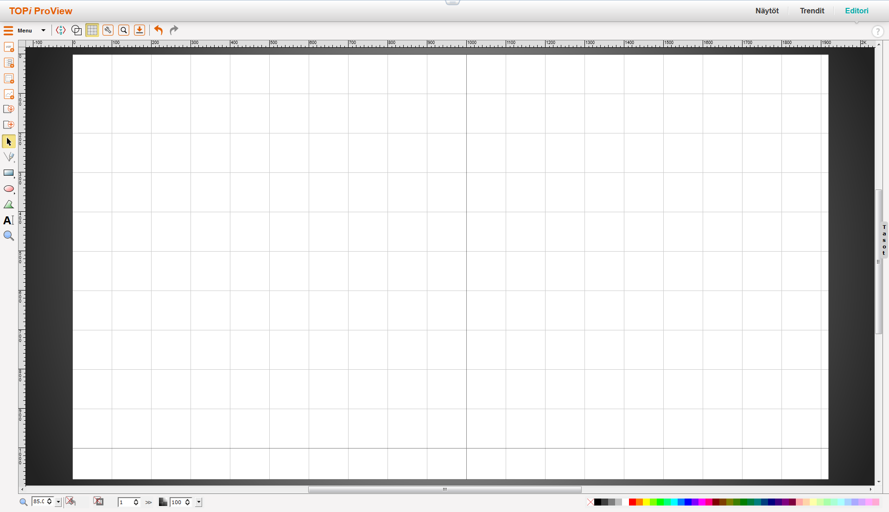
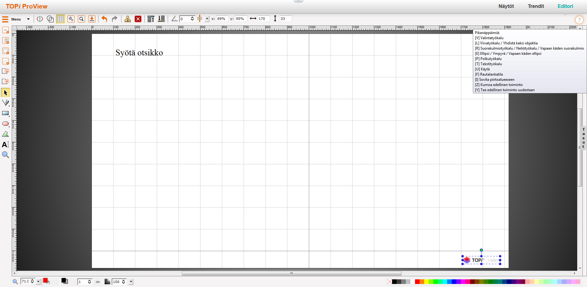
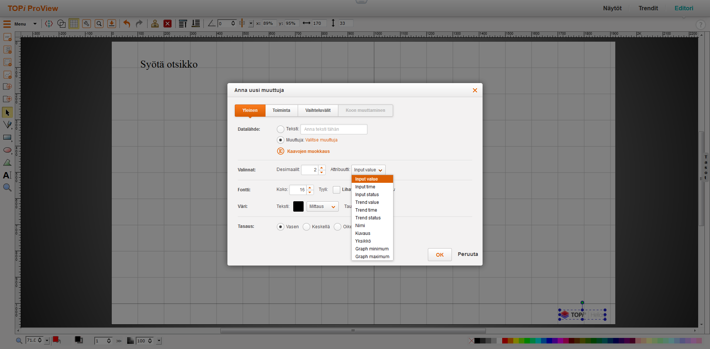
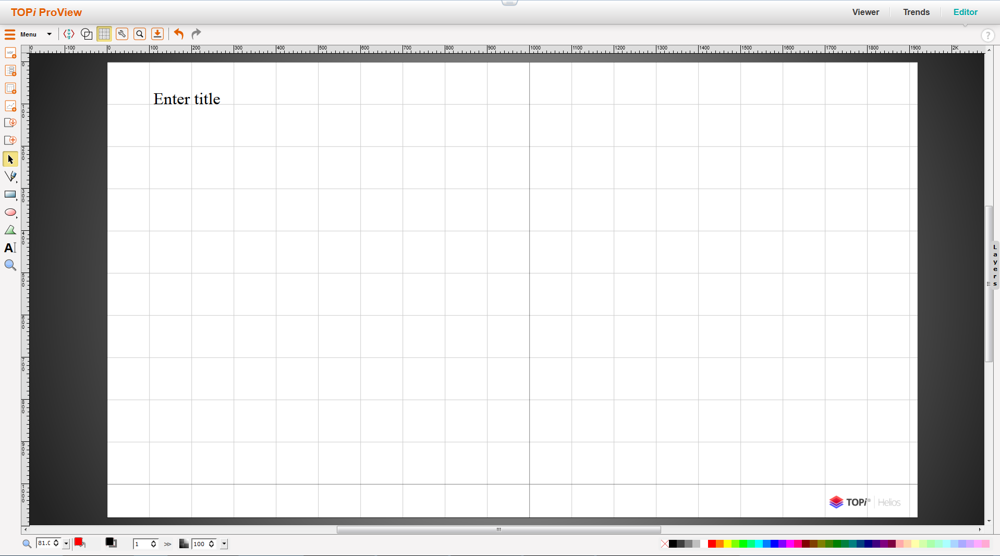

# Voimalaitosdatan visualisointityökalun jatkokehitys

## Johdanto

Kristian Laakkonen [1] toteutti diplomityönään selainpohjaisen ProView-nimisen tietojärjestelmän, jonka avulla voidaan havainnollistaa prosessitietoja käyttäjäystävällisesti. Tietojärjestelmässä voidaan luoda käyttäjille helppolukuisia prosessikaavionäyttöjä.

Järjestelmä tehtiin, koska aikaisemmissa työpöytäsovelluksissa on ollut omat rajoitteensa. Esimerkiksi työpöytäsovellukset täytyy asentaa erikseen kaikille tietokoneille ja ne on usein sidottu vain yhdelle käyttöjärjestelmälle ja myös ohjelmistojen päivitys on täytynyt tehdä jokaiselle koneelle erikseen. Diplomityönä valmistunut selainpohjainen järjestelmä korjasi nuo puutteet. Työasema tarvitsee vain web-selaimen, jonka avulla käyttäjä pääsee käyttämään järjestelmää. Järjestelmän ylläpito ja päivitykset tapahtuvat palvelinpäässä ja loppukäyttäjien suunnalta ei tarvita toimenpiteitä. Järjestelmä on ollut yleisessä käytössä useammalla asiakkaalla jo useamman vuoden. Tässä ajassa eri käyttäjäryhmät ovat tehneet paljon parannusehdotuksia.

Opinnäytetyöni käsittelee näitä parannusehdotuksia ja niiden toteuttamista. Tarkoituksena on toteuttaa versiopäivitys ProView 1.0:sta versioon ProView 1.1. Toimeksiantajana toimii Fortum Power and Heat Oyj. Parannusehdotusten toteuttaminen tekee tietojärjestelmästä enemmän asiakkaiden toiveiden mukaisen ja sitä kautta se tuo myös lisäarvoa toimeksiantajalleni.

## Tavoitteet

Työn tavoitteena oli jatkokehittää Kristian Laakkosen diplomityönä valmistunutta järjestelmää käyttäjäpalautteiden pohjalta ja sen avulla kasvattaa omaa osaamistani. Parannusehdotuksien suunnittelussa ja toteutuksessa joudun kiinnittämään huomiota minulle uusiin asioihin ohjelmistokehityksessä ja pääsen tutustumaan energia-alan lainalaisuuksiin.

## Rajaus

Opinnäytetyössä ei toteuteta uutta sovellusta, eikä uusia toiminnallisuuksia olemassa olevaan sovellukseen. Tarkoituksena on tutkia jo olemassa olevia ratkaisuja ja parannella niitä käyttäjäpalautteiden pohjalta. Opinnäytetyössä kerrotaan parannusehdotusten taustat, miksi ne halutaan ja kuinka toteutus tapahtui.

## Scrum

Scrum on ketterän projektityön viitekehys, minkä tarkoitus on tehdä monimutkaisesta projektityöstä mahdollisimman sujuvaa ja läpinäkyvää kaikille sidosryhmille. [2] Scrumissa työskentely aloitetaan niin, että Tuoteomistaja, joka on yksi Scrum tiimin rooleista [3], luo priorisoidun kehitysjonon halutuista kehityskohteista. Seuraava vaihe on Sprintin suunnittelu, missä kehitystiimi valitsee seuraavaan sprinttiin kehityskohteet priorisoidun listan mukaan.

Sprintit ovat yleensä lyhyitä työjaksoja, missä kehitysryhmä keskittyy työskentelemään vain kyseiseen sprinttiin valituiden kehityskohteiden parissa. Sprintin lopussa pidetään katselmointi, missä kehitystiimi, Tuoteomistaja ja mahdollisia muita sidosryhmiä tarkastavat Sprintin tuloksen ja antavat palautetta. [4] Tämä tuo läpinäkvyyttä projektityölle ja sidosryhmille mahdollisuuden nähdä projektin edistymisvaiheet. Lisäksi kehitystiimi voi reagoida muutostoiveisiin nopeasti ja tämän avulla asiakas saa varmemmin juuri toivotun kaltaisen lopputuloksen.

Opinnäytetyön aikana olin osana Scrum tiimiä, missä minä itse keskityin ProView 1.1 kehitykseen ja muut kehitystiimin jäsenet tekivät omia töitään saman sovelluskokonaisuuden parissa. Sidosryhmiin kuului ProView-työkalun käyttäjiä, joilta sain kehityksen aikana hyvää palautetta toteutuksistani ja kykenin yleensä myös reagoimaan niihin nopeasti. Ketterä kehitys ja Scrum toimi siis omalta osaltani loistavasti tämän projektin puitteissa.

## ProView 1.0

ProView on SVG-Edit nimisen avoimen lähdekoodin vektorigrafiikkaeditorin päälle rakennettu tietojärjestelmä. [6] Järjestelmä on osa Fortumin TOPi-tuoteperhettä [12] ja järjestelmällä on kaksi käyttötarkoitusta: Sillä täytyy pystyä luomaan ja tarkastelemaan prosessinäyttöjä. Prosessinäyttöjen luomiseen tarvittiin editori, mikä on tarpeeksi käyttäjäystävällinen ja että siinä on riittävästi toiminnallisuuksia. Nämä vaatimukset huomioon ottaen, päädyttiin valitsemaan SVG-Edit järjestelmän pohjaratkaisuksi. [7]

ProView:n prosessinäytöissä on staattisia ja muuttuvia elementtejä. Staattisilla elementeillä kuvataan yleensä eri prosessien yleinen kulku ja ns. isompi kokonaisuus. Muuttuvat elementit ovat prosessin sisällä olevat muuttujat, mitkä näyttävät erilaisia arvoja. Nämä arvot voivat olla esimerkiksi erilaisten pumppujen lämpötilat ym. prosessille tärkeät tiedot. ProView:n näyttöjä pidetään laitosten valvomoilla auki jatkuvasti ja on tarkoitus, että näiden näyttöjen perusteella voidaan tarkastella voimalaitosten eri prosesseja lähes reaaliaikaisesti. Tämän takia tietojärjestelmän täytyy hakea muuttujien arvoja tietokannasta tasaisin väliajoin.

Kristian Laakkosen diplomityön toteutushetkellä todettiin, että prosessinäytössä olevien muuttujilla pitää olla muutaman sekunnin päivitysväli. [9] Nämä vaatimukset huomioon ottaen todettiin, että WebSocket-teknologia olisi paras muuttujien arvojen hakemiseen tietokannasta, mutta ongelmaksi muodostui selaintuki. Järjestelmän täytyi tukea Internet Explorerin versioita 9, 10 ja 11 ja siksi tämä teknologia täytyi hylätä. [10] Koska WebSocket ei ollut toimiva ratkaisu, niin tiedonsiirtoon päätettiin käyttää AJAXia. (Asynchronous JavaScript and XML) [8]

## Kehityskohteet

Valitsimme ProView:n tuoteomistajan kanssa opinnäytetyölle kymmenen eri kehityskohdetta. Työskentely kehityskohteiden kanssa tapahtui Scrumin mukaisesti. Työskentelin niiden kanssa osa-aikaisesti kahden viikon sprinteissä ja työ todettiin valmiiksi, jos Sprintin katselmoinnissa ei löytynyt mitään valitettavaa.

### Editor-työkalun ruudukko-ominaisuus

ProView:n piirtotyökalussa on olemassa erillinen ruudukko-ominaisuus mikä tekee mm. viivojen piirtämisestä selkeämpää. Tämä ominaisuus täytyy erikseen valita, mutta käyttäjäpalautteen perusteella sen tulisi olla oletuksena päällä.

 Kuva 1

Kuvasta 1 näkyy miltä ProView:n ruudukko-ominaisuus näyttää käytännössä.

### Uudet resoluutiovaihtoehdot

Piirrettäville näytöille oli asetettu oletusresoluutioksi 1024 x 768 pikseliä. Toiveena oli lisätä erilaisia resoluutiovaihtoehtoja ja laittaa oletukseksi Full HD -resoluutio, eli 1920 x 1080 pikseliä.

### Pikanäppäin-painike

Editorityökalussa on useita erilaisia piirtotyökaluja ja ominaisuuksia, mihin löytyy myös pikanäppäimet sen sijaan, että käyttäjän tulisi valita hiirellä aina oikea työkalu. Ongelmana oli lähinnä se, että löytääksesi oikean pikanäppäimen työkalulle, sinun piti viedä hiiri haluamasi työkalun kohdalle ja vasta sitten ohjelma kertoi sinulle kyseisen työkalun pikanäppäimen. Toiveena oli saada editorityökaluun oma painike, mitä painamalla se näyttäisi sinulle kaikki eri työkalut ja niiden pikanäppäimet.

### Visuaalisten komponenttien uudelleensijoittelu

Uusiin näyttöihin voi lisätä erilaisia visuaalisia komponentteja. Neljä visuaalista komponenttia on laitettu oman painikkeen taakse. Nämä komponentit ovat: yksittäinen muuttuja, muuttujalista, taulukko ja graafi. Nämä komponentit haluttiin selkeämmälle paikalle.

### Vesileima

ProView ja TOPi ovat molemmat kaupallisia tuotteita ja toivottu lopputulos oli, että jos uusissa piirretyissä näytöissä näkyisi tuotteen logo, niin se olisi ilmaista mainosta toimeksiantajalle.

### Otsikkokenttä

On hyvien tapojen mukaista lisätä jokaiseen näyttöön oma otsikkokenttä tunnistettavuuden helpottamiseksi. Toiveena oli saada automatisoitua tätä niin, että uusiin näyttöihin lisätään automaattisesti otsikkokenttä, minkä sisältöä ja sijaintia käyttäjä voi halutessaan itse muuttaa.

### Kirjastokomponenttien yhtenäistäminen julkaisuversioihin

ProView:ssa on olemassa kirjasto erilaisia visuaalisia komponentteja, ne voi kuvastaa esimerkiksi lämpöpumppuja, moottoreita, putkia yms. julkaisuversioihin ei välttämättä päädy aina samat komponentit, koska testikantojen sisältö ei ole aina yhtenäinen. Tämä piti automatisoida niin, että julkaisuversioihin saataisiin aina identtinen, siistitty komponenttikirjasto.

### Mittauksien lasketun arvon automatisointi

Lasketut arvot merkitään prosessinäyttöihin eri tavalla. Aiemmin tapana oli tehdä niin, että jos muuttujan arvo oli laskettu, niin se muutettiin käsin oikeannäköiseksi. Tarkoituksena oli automatisoida niin, että sovellus kykenee itse päättelemään, että onko arvo laskettu ja jos on, niin muutetaan sen ulkoasu automaattisesti oikeanlaiseksi.

### Zoomaustyökalun käytettvyyden helpottaminen

Editorin zoomaustyökalun toiminnallisuus oli ongelmallinen. Työkalun zoomausnopeus oli liian nopea eikä se kohdistunut kunnolla. Ehdotettu korjaus oli, että työkalu rekisteröisi yhden rullaliikkeen sekunnissa, joten silloin zoomaus ei olisi liian nopea.

### Muuttujalistaan lisää dataa

Oletuksena muuttujalistassa näkyy muuttujan nimi, arvo ja yksikkö. Toiveena oli, että muuttujalistaan saataisiin näkyviin myös muuttujan raja-arvot sekä status.

## 1. Sprintti

Ensimmäisen sprintin suunnittelussa keskityttiin miettimään sidosryhmien kanssa opinnäytetyön laajuutta.
Sprintin suunnittelussa myös päätettiin, että aiemmin mainitut kehityskohteet ovat vain minun työlistallani ja muut Scrum tiimin jäsenet eivät ota niitä omalle työlistalleen. Minulle annettiin vapaat kädet päättää, että missä järjestyksessä teen tarvitttavat työt.

Valitsin ensimmäiseksi työtehtäväksi visuaalisten komponenttien uudelleensijoittelun. Lähtötilanne oli, että valittavat komponentit oli oman näkymän takana ja ne haluttiin siirtää ProView:n vasemmalla olevaan työkalupalkkiin muiden sekaan. Koodin puolelta tämä muutos tapahtui niin, että siirsin nämä erillisessä näkymässä olevat metodit, jotka lisäävät komponentteja ProView:n perusnäkymässä tapahtuvaan ohjelmakoodiin ja sijoitin halutut napit oikeille paikoille. Nappien kuvatkin löytyivät sopivasti valmiina ohjelmakoodin seasta, joten täytyi vain laittaa polut oikein. Tämän jälkeen tuo "valitse lisättävä komponentti" -näkymä oli luonnollisesti turha, joten sen pystyi kokonaan poistamaan.

Toinen työtehtävä liittyi resoluutioiden lisäämiseen ja oletusresoluution vaihtamiseen. Hetken koodia tutkittuani huomasin, että oletusresoluutio ja resoluutiovaihtoehdot oli kovakoodattu, joten pystyin vain suoraan lisäämään valmiisteen listaan uuden resoluutiovaihtoehdon.

Kolmas työtehtävä oli pikanäppäin-painikkeen tekeminen. Tavoitteena oli, että uudet käyttäjät löytävät painikkeen helposti ja, että se on helppolukuinen. Hetken pohtimisen jälkeen totesin, että ProView:n vasen ylänurkkaan sopii hyvin kysymysmerkkipainike, joka kertoo käyttäjälle, että sieltä löytyy apua sovelluksen käyttöön. Koodin puolelta muutos oli myös melko yksinkertainen. Frontendiin lisättiin uusi div-elementti ja määriteltiin tyylitiedostosta se näyttämään yhtenäiseltä muun ohjelmiston kanssa. Koska sovellus tukee useampia kieliä, niin sen sijaan, että ohjeet olisi suoraan kirjoitettu frontendiin, siellä vain viitattiin sovellukseen configuroituihin i18n-kielitiedostoihin, joihin laitoin ohjeet suomeksi ja englanniksi.

 Kuva 2

Kuvassa 2 näkyy pikanäppäin-painikkeen sisältö.

Sprintin viimeiseksi tehtäväksi jäi ProView:ssa olevan ruudukko-ominaisuuden päälle asettaminen oletuksena. Tähän tehtävään käytin kaikista eniten aikaa, sillä en meinannut millään löytää paikkaa, missä noita asioita käsitellään, mutta työtehtävä oli itsessään aika yksinkertainen. Lopulta löysin yhden JavaScript-olion, missä asetetaan uusien näyttöjen ja työkalujen oletustilat, joista minun täytyi muuttaa vaan yksi muuttuja false -> true.

Sprintin katselmoinnissa sidosryhmät tarkastelivat aikaan saatuja muutoksia, ja pääosin he olivat tyytyväisiä, mutta tuoteomistajalta tuli muutama korjauspyyntö. Komponenttien lisäyspainikkeiden kuvat haluttiin muuttaa, koska ne eivät sopineet yleiseen ulkoasuun muiden painikkeiden kanssa ja lisäksi uusi oletusresoluutio aiheutti sen, että uudet näytöt oli oletuksena zoomattu hieman liian lähelle. ProView:ssa on "sovita näyttöön" -toiminto erikseen, ja toiveena oli, että se tapahtuisi myös aina kun luodaan uusi näyttö. Muuten kaikkiin muihin muutoksiin oltiin tyytyväisiä.

## 2. Sprintti

Toisen sprintin suunnittelu oli opinnäytetyön puitteissa melko lyhyt. Työskentely jatkui samalla suunnitelmalla kuin ensimmäisessä sprintissä. Minun työtehtäväni olivat ProView 1.1 kehityskohteet ja minulla oli vapaus valita missä järjestyksessä toteutin niitä.

Aloitin tämän sprintin keskustelemalla kollegani kanssa ensimmäisen sprintin puutteista. Pyysin häntä ideoimaan ja toteuttamaan lisäyspainikkeiden uudet kuvat, sillä minulla ei ole oikeanlaista visuaalista silmää tällaisille asioille. Kun kollegani varmisti vielä sidosryhmiltä, että uudet kuvat istuvat muuhun ulkoasuun niin hän siirsi ne versionhallintaamme ja minun oli sitä kautta helppo ottaa ne käyttöön. Käytännössä minun täytyi vain vaihtaa kuvaelementtien tiedostopolut oikeanlaisiksi.

Seuraavaksi päätin hoitaa myös tuon toisen ongelman mikä mainittiin sprintin katselmoinnissa. Tavoitteena oli siis sovittaa uusi näyttö selaimeen niin, että se ei ole enää zoomattu liian lähelle. Toteutus oli tässäkin tapauksessa melko yksinkertainen. Piti vain tarkistaa, että miten SVG-Editissä on toteutettu tuo "Sovita näyttöön" -toiminto ja tehdä sama ratkaisu aina kun uusi näyttö luodaan.

Tarkoituksenani oli aloittaa "Mittauksen lasketun arvon automatisointi vielä toisella sprintillä, mutta valitettavasti onnistuin sairastumaan ja toisen sprintin työskentely loppui näihin työtehtäviin.

Sprintin katselmoinnissa esittelin tekemäni muutokset. Vaikka ne olivatkin melko vähäiset, niin sidosryhmät olivat tyytyväisiä. Uudet kuvat istuivat hyvin ProView-työkalun yleisilmeeseen ja näyttöjen kohdistaminen ilman ylimääräistä zoomausta toimi juuri kuten piti.

## 3. Sprintti

Aloitin sprintin hieman haasteellisemmalla tehtävällä. Päätin aloittaa Mittauksen lasketun arvon automatisoinnin. Prosessinäyttöihin voidaan tosiaan lisätä muuttujia ja niille muuttujille voidaan tehdä myös hyvin paljon muutoksia. Muuttujia voidaan hakea useammasta eri tietokannasta ja joissain tietokannassa sijaitsee vain tietynlaisia muuttujia, mille täytyy aina asettaa erilaiset parametrit tapauksesta riippuen.

 Kuva 3

Kuvassa 3 näkyy "Lisää muuttuja" -painikkeen luoma oma ikkuna, mistä päästään muuttamaan valitsemasi muuttujan asetuksia. Minun työtehtäväni ongelmatilanne oli sellainen, että jos valittu muuttuja oli ns. laskettu arvo, niin silloin sille täytyi aina asettaa samat muutokset. Nämä muutokset täytyi kuitenkin aina asettaa itse käsin. Tämä haluttiin automatisoida. Mikäli muuttuja oli laskettu arvo, niin silloin attribuutin täytyi olla kuvan 3 alasvetovalikossa näkyvä "trend value" ja samalla myös muuttujan väriä haluttiin muuttaa. Muuttujilla on myös todella suuri määrä attribuutteja määritelty tietokantaan, niistä minulle olennainen attribuutti oli "ip_plant_area". Suurin osa muuttujiin liittyvistä lainalaisuuksista jäi minulle vielä mysteeriksi, mutta ymmärsin, että jos plant_arean arvo oli CAL-alkuinen (Calculated Value), niin silloin sitä täytyy käsitellä kuin laskettua arvoa.

Tarkoituksena oli siis luoda toiminnallisuus, mikä tarkistaa muuttujan nimen ja tietokannan perusteella, että onko kyseisellä muuttujalla tietokannassa attribuuttia "ip_plant_area" ja jos on, niin onko se CAL-alkuinen. Tämä tapahtui käytännössä niin, että laitoin AJAX-kutsulla muuttujan nimen ja tietokannan nimen sovelluksen backendiin ja sinne luomaani omaan endpointtiin, mikä vuorostaan tarkisti näillä parametreillä, että onko kyseisellä muuttujalla attribuuttia "ip_plant_area" ja jos on, niin sitten tarkistetaan että onko se CAL-alkuinen. Seuraavaksi minun piti myös pohtia, että mitä tuo endpoint palauttaa takaisin frontendiin. Aluksi suunnittelin, että se palauttaisi kaikki attribuutit ja sitten frontendissä tehtäisiin tuo tarkistus. Keskustelin asiasta työtoverien kanssa ja totesimme, että vaikka tällä hetkellä muuttujan tiedot ovat aika teknistä tietoa eivätkä välttämättä kovin arkaluontoista, niin se on tulevaisuudessa silti mahdollista. Tämän perusteella päätin, että endpoint palauttaa tavallisen boolean arvon, mistä voi päätellä, että oliko muuttuja laskettu arvo vai ei. Sen perusteella oli myös helppo asettaa alasvetovalikosta tietty vaihtoehto suoraan valituksi ja vaihdettua väri oikeanlaiseksi, kun käyttäjä valitsee tietyn muuttujan.

Zoomin korjaaminen osoittautui taas hieman erilaiseksi haasteeksi. ProView:n zoomaus toimi alunperin erittäin oudosti, se ei kohdistunut järkevästi ja sitä oli erittäin vaikea hallinnoida. Tuoteomistaja ja muut sidosryhmät ehdottivat ratkaisuksi, että zoomausta rajoitettaisiin ajastimella niin, että se rekisteröisi vain yhden rullaliikkeen sekunnissa ja sen avulla sitä olisi helpompi hallita. Totesin tosin, että oikea ongelma oli tuossa zoomauksen kohdistamisessa, joten pyrin ratkaisemaan ongelman sen avulla. Tämä ei ollut mitenkään helppo työ. SVG-editin oma koodi ei ollut kaikista ymmärretävin ja zoomilogiikka itsessään ei avautunut minulle hirveästi. Päätin siis kokeilla, että löytyykö ratkaisua netistä. Luojan kiitos avoimelle lähdekoodille, sille SVG-Editin omilla Github-sivuilla joku toinen käyttäjä oli turhautunut samaan ongelmaan ja hän oli tehnyt siihen ratkaisun, minkä avulla zoomaus kohdistuu juuri siihen, missä hiiren kursori sijaitsee. [11] Minun täytyi vaan siirtää nuo samat muutokset meidän omaan koodiin ja kokeilla, että kaikki toimi kuten piti. Tässä tehtävässä tiedonhaku ja avoimen lähdekoodin projektien yhteistyö näytti hyvät puolensa.

Sprintin katselmoinnissa oltiin erittäin tyytyväisiä lopputuloksiin. Varsinkin zoomin korjaus on sellainen ominaisuus, minkä korjauksia oltiin odotettu jo pitkään. Sidosryhmät olivat nähneet sen toiminnallisuuden ongelmallisena lähes alusta lähtien. Lasketun arvon automatisointi oli myös toivottu uudistus ja sen toiminnallisuus vastasi sidosryhmien odotuksia.

## 4. Sprintti

Neljännes sprintti keskittyi uusien SVG-elementtien lisäämiseen uuteen näyttöön. Halusin saada vesileiman ja otsikkokentän lisättyä uusiin näyttöihin.

Vesileiman tarkoitus oli toimia TOPi-tuoteperheen mainoksena, koska Fortumin asiakkaat voivat näyttää ProView:lla tehtyjä prosessinäyttöä myös kolmansille osapuolille ja tätä kautta on teoreettinen mahdollisuus saada myös uusia asiakkaita. TOPin projektivarastossa on mukana kuvakirjasto, missä on mukana myös TOPIn logo SVG-muodossa ja tarkoituksena oli luoda toiminnallisuus mikä hakee tämän logon uusiin prosessinäyttöihin aina automaattisesti ja tekee siitä uuden kuvaelementin ja sijoittaa sen prosessinäytön oikeaan alalaitaan.

Ensimmäinen ratkaisuni oli toteuttaa uusi AJAX-kutsu, missä backend hakisi tuon kuvatiedoston ja koodittaisi kuvatiedoston Base64-muotoon ja palauttaisi sen samassa muodossa frontendiin. Ongelmaksi tässä ratkaisussa muodostui se, että olisi teoriassa mahdollista, että tarpeeksi huonoilla yhteyksillä kuvatiedosto ei ehtisi latautua uuteen prosessinäyttöön tarpeeksi nopeasti, koska AJAX-kutsut ja JavaScript itsessään ovat asynkronisia, eli tässä tapauksessa ohjelmakoodin toteutus jatkuisi vesileiman hakufunktion aikana, jos se kestäisi jostain syystä tavallista pidempään. Ratkaisu tähän ongelmaan oli onneksi melko yksinkertainen. Backendin logiikka ei varsinaisesti muuttunut. Sen sijaan, että olisin luonut uuden endpointin, tein uuden Java-luokan, missä oli sama toiminnallisuus. Tämän jälkeen lisäsin ProView:n jsp-tiedostoon ohjelmakoodia, mikä asettaa uuteen JavaScript muuttujaan TOPi-logon base64-muodossa. Tämä ratkaisee ongelman, koska jsp-tiedostot ladataan kokonaan ennen kuin JavaScript-tiedostot aloittaa toimintansa. Frontendin puolella oli tämän jälkeen vain tehtävä funktio, mikä lisää TOPi-logon uudeksi kuvaelementiksi ja laittaa kyseinen funktio käynnistymään sen jälkeen kun uusi näyttö luodaan.

Otsikkokenttä oli vuorostaan yksinkertaisempi työ, koska sitä varten ei tarvinnut tehdä backendiin oikeastaan mitään. Sen sijaan frontendiin luotiin vain uusi funktio, mikä lisää uuden tekstielementin ja laittaa kyseinen funktio käynnistään uuden näytön luomisen jälkeen.

 Kuva 4.

Kuvassa 4 näkyy TOPi:n logo ja otsikkokenttä uudessa näytössä.

## Lähteet

1. Kristian Laakkonen, Selainpohjainen tietojärjestelmä prosessitiedon havainnollistamiseen
2. What is Scrum? Luettavissa: https://www.scrum.org/resources/what-is-scrum. Luettu: 12.04.2018
3. Scrum Roles Demystified. Luettavissa: https://www.scrumalliance.org/agile-resources/scrum-roles-demystified. Luettu: 12.04.2018
4. What is a Sprint? Luettavissa: https://www.scrum-institute.org/What_is_a_Sprint.php. Luettu: 12.04.2018
5. Kristian Laakkonen, Selainpohjainen tietojärjestelmä prosessitiedon havainnollistamiseen, s. 14 kappale 3.6.5. Luettu: 02.05.2018
6. SVG-Edit https://github.com/SVG-Edit
7. Kristian Laakkonen, Selainpohjainen tietojärjestelmä prosessitiedon havainnollistamiseen, s. 35 kappale 6.2.2. Luettu: 02.05.2018
8. Kristian Laakkonen, Selainpohjainen tietojärjestelmä prosessitiedon havainnollistamiseen, s. 55 kappale 7.3. Luettu: 30.7.2018
9. Kristian Laakkonen, Selainpohjainen tietojärjestelmä prosessitiedon havainnollistamiseen, s. 32 kappale 5.1. Luettu: 30.7.2018
10. Kristian Laakkonen, Selainpohjainen tietojärjestelmä prosessitiedon havainnollistamiseen, s. 55 kappale 7.2. Luettu: 30.7.2018
11. SVG-Edit, Github.com Luettavissa: https://github.com/SVG-Edit/svgedit/pull/169, luettu: 03.08.2018
12. TOPi, luettavissa: https://www.fortum.fi/yrityksille-ja-yhteisoille/palvelut-voimalaitoksille/lampovoimalaitoksille-ja/energianhallinta-ja-2 luettu: 06.08.2018
13. Introduction to asynchronous JavaScript, luettavissa: https://www.pluralsight.com/guides/introduction-to-asynchronous-javascript luettu: 06.08.2018
